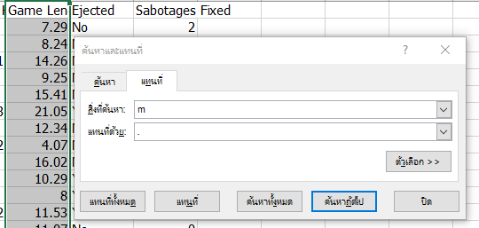

# Cleaning Dataset

## Step 1.) Loading library and dataset
```{R}
#Loading library
library(dplyr)
library(stringr)
library(tidyr)
library(assertive)
library(readr)
library(tidyr)

#Loading DataSet
read.csv("C:\\Users\\Admin\\Desktop\\214mid\\amongUs_original.csv")
amongUs <- read.csv("C:\\Users\\Admin\\Desktop\\214mid\\amongUs_original.csv")
View(amongUs)
```


## Step 2.) TransformData
```{R}
amongUs <- amongUs %>% rename(
  
  Date = X.ปฟGame.Completed.Date,
  MyTaskCompleted = Task.Completed,
  AllTeamTasksCompleted = All.Tasks.Completed,
  MyKills = Imposter.Kills,
  TotalTimePerMin = Game.Length,
  MySabotagesFixed = Sabotages.Fixed
  
)
```
## Step 3.) Clean data

### 3.1) Check data type
เช็ค type ของ dataset เรา
```{R}
glimpse(amongUs)
```
ผลลัพท์ 
```{R}
$ X.ปฟGame.Completed.Date <chr> "12/13/2020 at 1:46:30 am EST", "12/13/2020 at 1:37:06 am EST", "12/13/2020 at 1:22:~
$ Team                    <chr> "Crewmate", "Crewmate", "Imposter", "Crewmate", "Crewmate", "Imposter", "Crewmate", ~
$ Outcome                 <chr> "Win", "Loss", "Loss", "Win", "Win", "Loss", "Win", "Win", "Loss", "Loss", "Loss", "~
$ Task.Completed          <chr> "4", "8", "-", "5", "9", "-", "7", "-", "7", "6", "3", "-", "7", "2", "5", "4", "-",~
$ All.Tasks.Completed     <chr> "No", "Yes", "-", "No", "Yes", "-", "Yes", "-", "Yes", "No", "No", "-", "Yes", "No",~
$ Murdered                <chr> "Yes", "Yes", "-", "No", "Yes", "-", "No", "-", "No", "No", "No", "-", "No", "No", "~
$ Imposter.Kills          <chr> "-", "-", "1", "-", "-", "3", "-", "2", "-", "-", "-", "2", "-", "-", "-", "-", "1",~
$ Game.Length             <chr> 7m29s, 8m24s, 14m26s, 9m25s, 15ms41, 21m05s, 12m34s, 4m07s, 16m02s, 10m29s, 8m00s, 11m53s, 11m07s~
$ Ejected                 <chr> "No", "No", "No", "No", "No", "Yes", "No", "No", "No", "Yes", "Yes", "Yes", "No", "N~
$ Sabotages.Fixed         <chr> "2", "1", "N/A", "1", "0", "N/A", "1", "N/A", "1", "0", "0", "N/A", "0", "1", "0", "~
```
<p> เราจะพบว่าทุกตัวแปรเป็น chr หมดเลย </p>

### 3.2) แปลงเป็น numeric และ ลบ String "-" กับ "N/A" ออก
```{R}
##ลบ - ออก
is.numeric(amongUs$MyTaskCompleted)
amongUs$MyTaskCompleted <- amongUs$MyTaskCompleted %>% str_remove("-") %>% as.numeric()

is.numeric(amongUs$MyKills)
amongUs$MyKills <- amongUs$MyKills %>% str_remove("-") %>% as.numeric()

##ลบ N/A ออก
is.numeric(amongUs$MySabotagesFixed)
amongUs$MySabotagesFixed <- amongUs$MySabotagesFixed %>% str_remove("N/A") %>% as.numeric()
```
### 3.3) แปลงเป็น factor เพื่อที่จะนำข้อมูลไปคำนวน
```{R}
amongUs$Team <- as.factor(amongUs$Team)
summary(amongUs$Team)

amongUs$Outcome <- as.factor(amongUs$Outcome)
summary(amongUs$Outcome)

amongUs$AllTeamTasksCompleted <- as.factor(amongUs$AllTeamTasksCompleted)
summary(amongUs$AllTeamTasksCompleted)

amongUs$Murdered <- as.factor(amongUs$Murdered)
summary(amongUs$Murdered)

amongUs$Ejected  <- as.factor(amongUs$Ejected)
summary(amongUs$Ejected)


```
### 3.4) Game.Length หรือ TotalTimePerMin ใช้ excel ในการแปลงจาก 00m00s เป็น 00.00

โดยการใช้ฟังช์กัน ctrl + H  


