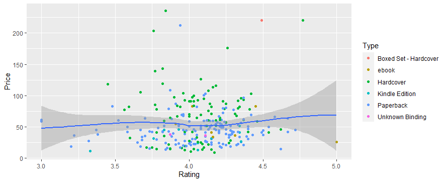
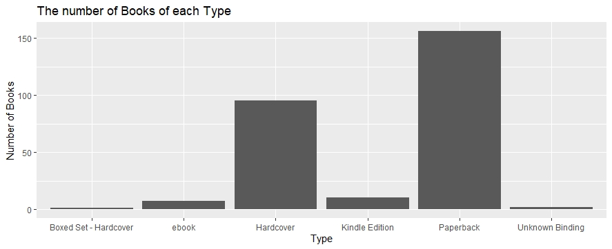

## Part 4: Visualization with GGplot2
### 1.) Graph show relation between Rating and Price classified by Type.
```
scat_plot <- prog_book %>% ggplot(aes(x=Rating, y=Price))+
  geom_point(aes(color=Type))
  
scat_plot+geom_smooth() 
```
Result:



จากกราฟด้านบน จะเห็นได้ว่าหนังสือที่มีราคาประมาณ $50 จะมี Rating อยู่ในช่วง 3.5 - 4.5 คะแนน
แสดงให้เห็นถึงหนังสือที่ราคาไม่ได้สูงมากก็มีคะแนน Rating เยอะอยู่พอสมควร

### 2.) Graph show relation Number of Books of each Type.
```
bar_plot <- ggplot(prog_book,aes(x=Type)) + geom_bar()
bar_plot + ggtitle("The number of Books of each Type") +
  xlab("Type") + ylab("Number of Books") 
```
Result:



จากการฟด้านบน แสดงจำนวนหนังสือโดยแยกแต่ละประเภทของหนังสือ จะเห็นได้ว่าหนังสือประเภท Paperback มีจำนวนมากที่สุด

### Creating Interaction Dashboard with BI Tools : Power BI to make a graph 👉[Click here](https://app.powerbi.com/view?r=eyJrIjoiMTE2ZDgzMTEtMDI4Zi00OGY1LTliMjgtMTRkYjMyNTE0YmQyIiwidCI6IjZmNDQzMmRjLTIwZDItNDQxZC1iMWRiLWFjMzM4MGJhNjMzZCIsImMiOjEwfQ%3D%3D)
