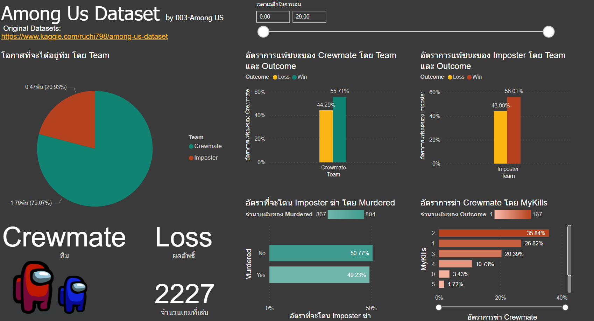

# Data Visualization (BI Tools)

### Dashboard Overview [click](https://app.powerbi.com/view?r=eyJrIjoiNWNmMWYwZjMtNmU3OC00YWIwLTliMDAtZjBiOTMzODlmMDZmIiwidCI6IjZmNDQzMmRjLTIwZDItNDQxZC1iMWRiLWFjMzM4MGJhNjMzZCIsImMiOjEwfQ%3D%3D&pageName=ReportSection&fbclid=IwAR0jy2TXxFxnJv_XbMraaAUzZY_ZO6E_0VTkMkRpVEQnTM9DFE2WUz75RSY)

### จากการใช้ Bi tool ในการสำรวจข้อมูล ทำให้ทราบข้อมูลดังนี้

1. จากกราฟ Streams by Release Month จะพบว่าในช่วงเดือนพฤษภาคมมีการเข้าใช้บริการบ่อยที่สุด ซึ่งเป็นไปได้ว่าหากศิลปินทำการปล่อยเพลงในเดือนนี้ จะทำให้เพลงได้รับความนิยมมากขึ้น 
2. จากกราฟ Popularity Chord จะทำให้ทราบว่าเพลงที่ติดอันดับ 200 อันดับแรก ส่วนใหญ่ใช้คอร์ด C#/Db เป็นคอร์ดหลักในการทำเพลง
3. จากกราฟ Popularity Genre พบว่าแนวเพลง dance pop, pop, post-teen pop เป็นที่นิยมมากที่สุด แต่แนวเพลง dance pop, edm, electro house, moombahton, pop, pop dance, pop rap เป็นแนวเพลงที่ได้รับความนิยมน้อยที่สุด หากศิลปินต้องการให้เพลงของตนเองได้รับความนิยม ก็อาจจะใช้ข้อมูลจากกราฟนี้เป็นการประกอบการตัดสินใจได้
4. จากกราฟ Artist Followers and Streams by Artist บอกได้ว่าความนิยมของเพลงไม่ได้ขึ้นอยู่กับจำนวนของผู้ติดตามของศิลปินนั้น
5. จาก Artist Followers สามารถบอกได้ว่าใน spotify มีจำนวนผู้ติดตามทั้งหมด 22.74 พันล้านคน ซึ่งเป็นจำนวนจาก 200 อันดับแรกของปี 2020 และ 2021
6. จากกราฟ Streams สามารถบอกได้ว่าใน spotify มีจำนวนการใช้บริการทั้งหมด 9.87 พันล้านครั้ง ซึ่งเป็นจำนวนจาก 200 อันดับแรกของปี 2020 และ 2021
7. จากกราฟ Streams by Song Name จะบอกจำนวนการสตรีมของแต่ละเพลง ซึ่งเพลง Beggin' มีจำนวนการสตรีมมากที่สุด จึงเป็นเพลงที่ได้รับความนิยมมากที่สุด

 
### Dashboard Imposter and Crewmate [click](https://app.powerbi.com/view?r=eyJrIjoiNWNmMWYwZjMtNmU3OC00YWIwLTliMDAtZjBiOTMzODlmMDZmIiwidCI6IjZmNDQzMmRjLTIwZDItNDQxZC1iMWRiLWFjMzM4MGJhNjMzZCIsImMiOjEwfQ%3D%3D&pageName=ReportSection&fbclid=IwAR0jy2TXxFxnJv_XbMraaAUzZY_ZO6E_0VTkMkRpVEQnTM9DFE2WUz75RSY)

## Imposter

1 จากกราฟ อัตราชนะโดยทีม imposter จะทำให้ทราบอัตราชนะเฉพาะทีม imposter 
2 จากกราฟ จำนวนการฆ่าและผลเกม จะทำให้ทราบ การฆ่ากับอัตราชนะของทีม imposter ยิ่งฆ่าเยอะจะยิ่งมีโอกาศชนะมากขึ้น
3 จากกราฟ จำนวนการโดนโหวตออกโดยเทียบกับการฆ่า จะทำให้ทราบถึง หากเราเอาตัวรอดจากการประชุมครั้งที่ 1-2 ได้ การฆ่าครั้ง 3 เป็นต้นไปเราจะมีโอกาศน้อยที่ตกเป็นผู้ต้องสงสัย เพราะถ้าไม่โดนโหวตตั้งแต่ครั้งแรกๆ แสดงว่า ผู้บริสุทคนอื่นได้เชื่อใจเราไปแล้ว แสดงว่าแค่เราเอาตัวรอดจากการโดนโหวตครั้งที่1-2 เราจะมีโอกาศชนะมากขึ้น
4 มีจำนวนโหวตออก ค่าเฉลี่ยเวลาในการเล่น ค่าเฉลี่ยในการฆ่า ฆ่าสูงสุด ต่ำสุด 
5 สามารถขยับแทบเวลาในการเล่น เพื่อดูผลที่เปลี่ยนแปลง 
6 สามารถติ้กดูจำนวนการฆ่า เพื่อดูผลที่เปลี่ยนแปลงได้

## Crewmate

1. จากกราฟ outcome จะทำให้ทราบอัตราชนะเฉพาะทีม Crewmate
2. จากกราฟ allTeamTasksCompleted จะทำให้ทราบ ถึงโอกาศที่ทั้งทีมจะทำภารกิจสำเร็จ
3. จากกราฟ sabotageFix จะทำให้ทราบถึง โอกาศที่จะชนะเมื่อซ่อมไฟสำเร็จ
4. จากกราฟ TaskCompletedและoutcome จะทำให้ทราบถึง อัตราชนะเมื่อเทียบกับการทำภารกิจของตัวเอง
5. สามารถขยับแทบเวลาในการเล่น เพื่อดูผลที่เปลี่ยนแปลง 
6. มีบอกค่าเฉลี่ยต่างๆ
