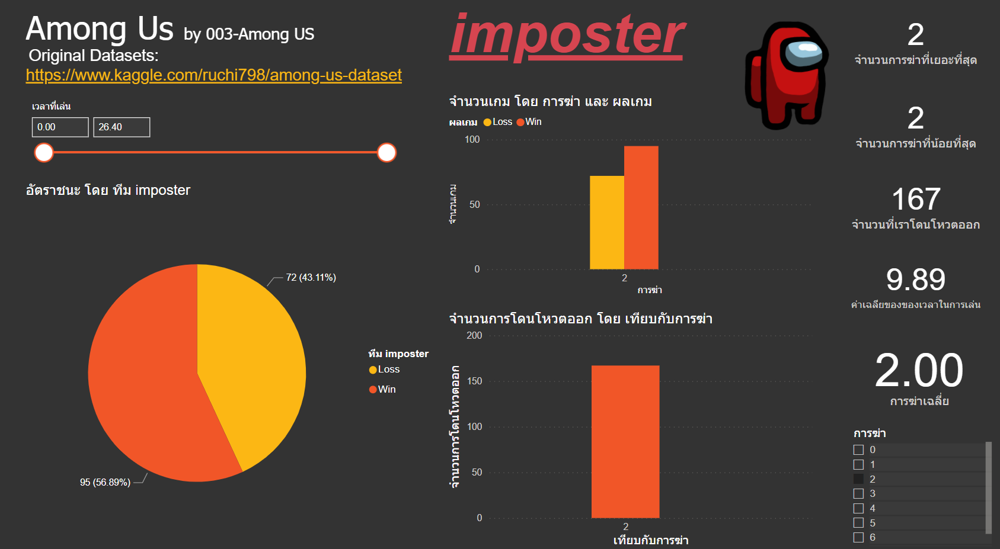
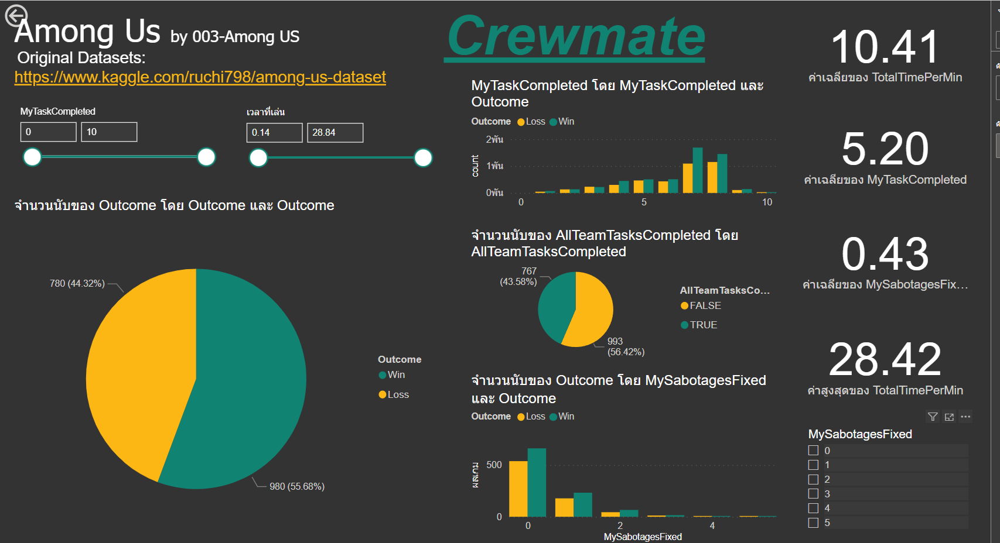

# Data Visualization (BI Tools)

### Dashboard Overview [click](https://app.powerbi.com/view?r=eyJrIjoiNWNmMWYwZjMtNmU3OC00YWIwLTliMDAtZjBiOTMzODlmMDZmIiwidCI6IjZmNDQzMmRjLTIwZDItNDQxZC1iMWRiLWFjMzM4MGJhNjMzZCIsImMiOjEwfQ%3D%3D&pageName=ReportSection&fbclid=IwAR0jy2TXxFxnJv_XbMraaAUzZY_ZO6E_0VTkMkRpVEQnTM9DFE2WUz75RSY)

### จากการใช้ Bi tool ในการสำรวจข้อมูล ทำให้ทราบข้อมูลดังนี้

1 จากกราฟ Pie Chart จะพบว่าจะมีโอกาสที่จะได้อยู่ทีม Crewmate มากกว่าทีม Imposter โดยแต่ละทีมมีโอกาสเฉลี่ยที่ 79.07% และ 20.93% ตามลำดับ
2 จาก Card จพแสดงชื่อทีม ผลลัพธิ์จากการแข่ง และจำนวนเกมทั้งหมดที่เล่น
3 จาก Slicer จะสามารถเลือกแสดงระยะเวลาตามที่เราต้องการทราบข้อมูลได้
4 จากกราฟ Clustered column chart จะเปรียบเทียบอัตราการแพ้ชนะของทีมฝั่ง Crewmate เมื่อเทียบกับข้อมูลทั้งหมด 2,227 เกมที่เล่น ผลคือ มีอัตราชนะอยู่ที่ 55.71% และอัตราแพ้อยู่ที่ 44.29% 
5 จากกราฟ Stacked bar chart จะเปรียบเทียบอัตราที่ Crewmate จะโดน Imposter ฆ่า ผลคือ มีโอกาสโดนฆ่าอยู่ที่ 49.23% และมีโอกาสไม่โดนฆ่า 50.77%
6 จากกราฟ Clustered column chart จะเปรียบเทียบอัตราการแพ้ชนะของทีมฝั่ง Imposter เมื่อเทียบกับข้อมูลทั้งหมด 2,227 เกมที่เล่น ผลคือ มีอัตราชนะอยู่ที่ 56.01% และอัตราแพ้อยู่ที่ 43.99%
7 จากกราฟ Stacked bar chart จะเปรียบเทียบอัตราการฆ่า Crewmate ของฝั่ง Imposter ผลคือ มีโอกาส 35.84% ที่จะฆ่าได้ 2 คน, มีโอกาส 26.82% ที่จะฆ่าได้ 1 คน, มีโอกาส 20.39% ที่จะฆ่าได้ 3 คน, มีโอกาส 10.73% ที่จะฆ่าได้ 4 คน, มีโอกาส 3.43% ที่จะฆ่าไม่ได้เลย, มีโอกาส 1.72% ที่จะฆ่าได้ 5 คน, มีโอกาส 0.86% ที่จะฆ่าได้ 6 คน และมีโอกาส 0.21% ที่จะฆ่าได้ 8 คน

 
### Dashboard Imposter and Crewmate [click](https://app.powerbi.com/reportEmbed?reportId=0da30f89-d5e8-48ab-9328-81e3c95199bf&autoAuth=true&ctid=6f4432dc-20d2-441d-b1db-ac3380ba633d&config=eyJjbHVzdGVyVXJsIjoiaHR0cHM6Ly93YWJpLXNvdXRoLWVhc3QtYXNpYS1yZWRpcmVjdC5hbmFseXNpcy53aW5kb3dzLm5ldC8ifQ%3D%3D&fbclid=IwAR1tBEU_EY1U_XeRdllblqA5-EjBnNKIf88qKi_-qpL11dhEol6nVqjoT08)

## Imposter

1 จากกราฟ อัตราชนะโดยทีม imposter จะทำให้ทราบอัตราชนะเฉพาะทีม imposter 
2 จากกราฟ จำนวนการฆ่าและผลเกม จะทำให้ทราบ การฆ่ากับอัตราชนะของทีม imposter ยิ่งฆ่าเยอะจะยิ่งมีโอกาศชนะมากขึ้น
3 จากกราฟ จำนวนการโดนโหวตออกโดยเทียบกับการฆ่า จะทำให้ทราบถึง หากเราเอาตัวรอดจากการประชุมครั้งที่ 1-2 ได้ การฆ่าครั้ง 3 เป็นต้นไปเราจะมีโอกาศน้อยที่ตกเป็นผู้ต้องสงสัย เพราะถ้าไม่โดนโหวตตั้งแต่ครั้งแรกๆ แสดงว่า ผู้บริสุทคนอื่นได้เชื่อใจเราไปแล้ว แสดงว่าแค่เราเอาตัวรอดจากการโดนโหวตครั้งที่1-2 เราจะมีโอกาศชนะมากขึ้น
4 มีจำนวนโหวตออก ค่าเฉลี่ยเวลาในการเล่น ค่าเฉลี่ยในการฆ่า ฆ่าสูงสุด ต่ำสุด 
5 สามารถขยับแทบเวลาในการเล่น เพื่อดูผลที่เปลี่ยนแปลง 
6 สามารถติ้กดูจำนวนการฆ่า เพื่อดูผลที่เปลี่ยนแปลงได้

## Crewmate

1. จากกราฟ outcome จะทำให้ทราบอัตราชนะเฉพาะทีม Crewmate
2. จากกราฟ allTeamTasksCompleted จะทำให้ทราบ ถึงโอกาศที่ทั้งทีมจะทำภารกิจสำเร็จ
3. จากกราฟ sabotageFix จะทำให้ทราบถึง โอกาศที่จะชนะเมื่อซ่อมไฟสำเร็จ
4. จากกราฟ TaskCompletedและoutcome จะทำให้ทราบถึง อัตราชนะเมื่อเทียบกับการทำภารกิจของตัวเอง
5. สามารถขยับแทบเวลาในการเล่น เพื่อดูผลที่เปลี่ยนแปลง 
6. มีบอกค่าเฉลี่ยต่างๆ

